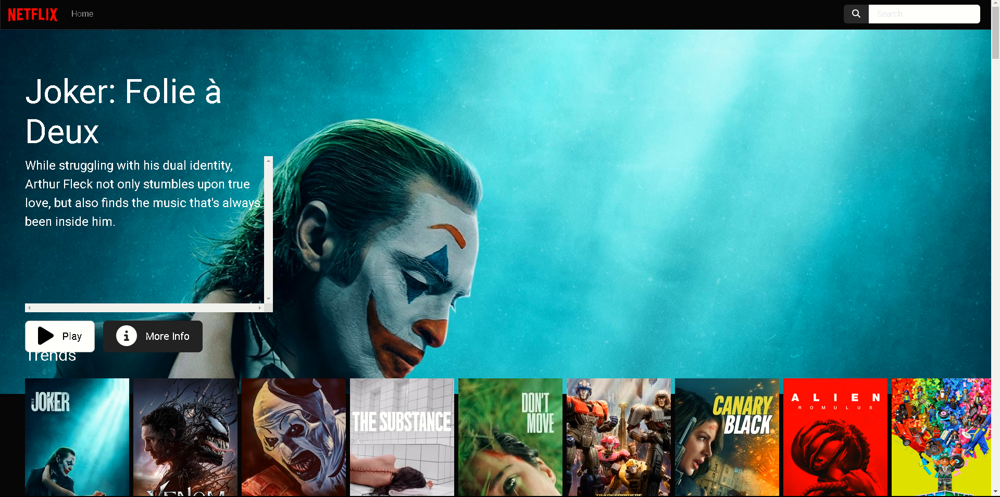

# Netflix Clone 🎬

Este proyecto es un clon de la interfaz de usuario de Netflix, desarrollado con **Angular**. Permite a los usuarios navegar y explorar un catálogo de películas y series en una interfaz atractiva y funcional, que simula la experiencia de Netflix.

 <!-- Asegúrate de reemplazar esta ruta con la correcta -->

## Tabla de Contenidos
- [Características Clave](#características-clave)
- [Requisitos Previos](#requisitos-previos)
- [Instalación](#instalación)
- [Uso](#uso)
- [Compilación](#compilación)
- [Pruebas Unitarias](#pruebas-unitarias)
- [Pruebas End-to-End](#pruebas-end-to-end)
- [Ayuda Adicional](#ayuda-adicional)

## Características Clave
- 🎥 **Interfaz estilo Netflix**: Simulación de la experiencia de usuario de la plataforma original.
- 🔍 **Exploración de contenido**: Navega por un catálogo ficticio de películas y series.
- 🚀 **Arquitectura modular**: Dividido en componentes escalables y reutilizables.

## Requisitos Previos
Antes de comenzar, asegúrate de tener instaladas las siguientes herramientas:
- [Node.js](https://nodejs.org/)
- [Angular CLI](https://angular.io/cli)

## Instalación
1. Clona el repositorio en tu máquina local:
   ```bash
   git clone https://github.com/tu-usuario/netflix-clone.git
   cd netflix-clone
   ```

2. Instala las dependencias del proyecto:
   ```bash
   npm install
   ```

## Uso
Inicia el servidor de desarrollo:
```bash
ng serve
```
Navega a `http://localhost:4200/` en tu navegador. La aplicación se recargará automáticamente al realizar cambios en los archivos fuente.

## Compilación
Para compilar el proyecto para producción, ejecuta:
```bash
ng build
```
Los archivos compilados se almacenarán en el directorio `dist/`.

## Pruebas Unitarias
Para ejecutar las pruebas unitarias a través de [Karma](https://karma-runner.github.io), utiliza:
```bash
ng test
```

## Pruebas End-to-End
Para ejecutar pruebas de extremo a extremo, primero debes instalar un paquete de pruebas como **Protractor** o **Cypress**. Luego, puedes ejecutar:
```bash
ng e2e
```

## Ayuda Adicional
Para obtener más ayuda sobre Angular CLI, usa:
```bash
ng help
```
También puedes consultar la [documentación oficial de Angular CLI](https://angular.io/cli).

